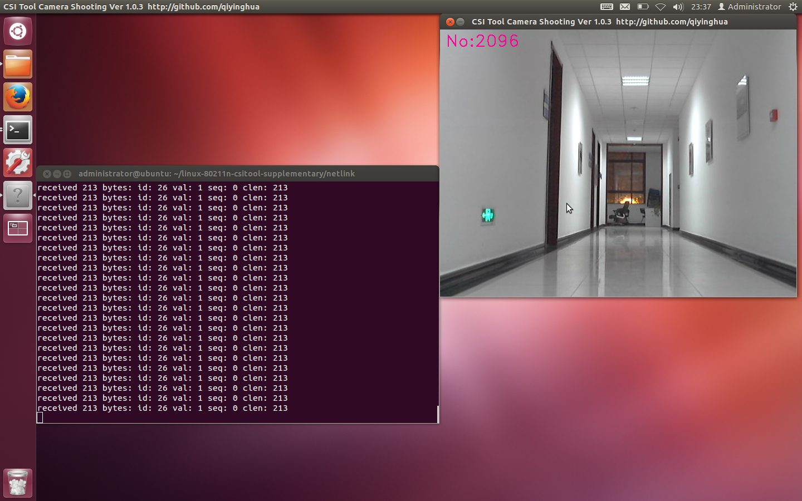
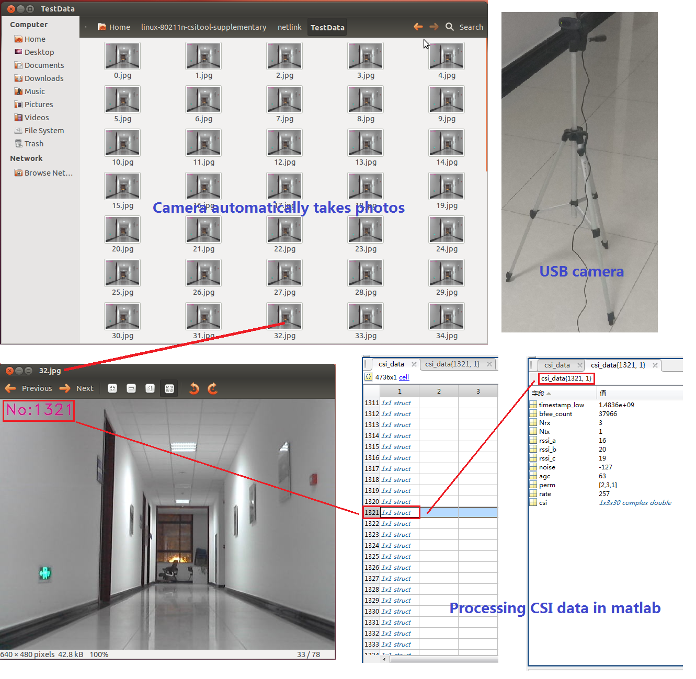

# CSI-Tool-Camera-Shooting

# What is it used for?

**This program is based on Linux 802.11n CSI Tool. This program automatically takes a photo with the camera and attaches the current CSI Packet ID to the photo. These photos are saved in a folder with the same name as your CSI data file.**
## Screenshot

## Detail

# Install
This code is based on Linux 802.11n CSI Tool http://dhalperi.github.io/linux-80211n-csitool/ . Make sure you have installed it and can use it properly.

**Download this project and install Opencv firstly.If you have already installed Opencv, go directly to Step 6.If you fail to install Opencv according to Step1-Step5, please find other installation help on the Internet. Please make sure you have successfully installed Opencv before running Step6.**

Step 1. Install package
~~~
sudo apt-get install build-essential
sudo apt-get install libgtk2.0-dev
sudo apt-get install pkg-config 
sudo apt-get install cmake
~~~

Step 2. Unzip Opencv

&nbsp;&nbsp;&nbsp;Run commands under `CSI-Tool-Camera-Shooting` folder:
~~~
unzip opencv-2.4.13.6.zip
cd opencv-2.4.13.6/install
~~~

Step 3. Compile and install Opencv
~~~
cmake -D CMAKE_BUILD_TYPE=RELEASE -D CMAKE_INSTALL_PREFIX=/usr/local ..
cmake ..
make
sudo make install
~~~

Step 4. Configuration Opencv
~~~
sudo gedit /etc/ld.so.conf.d/opencv.conf
~~~
&nbsp;&nbsp;&nbsp;Then add the `/usr/local/lib` command to the file.
~~~
sudo ldconfig
sudo gedit /etc/bash.bashrc
~~~
&nbsp;&nbsp;&nbsp;Then add the following command to the end of file:

>`PKG_CONFIG_PATH=$PKG_CONFIG_PATH:/usr/local/lib/pkgconfig`

>`export PKG_CONFIG_PATH`

Step 5. Reboot and finish install Opencv
~~~
sudo reboot
~~~

Step 6. Compile User APP [ For Linux 802.11n CSI Tool ]

&nbsp;&nbsp;&nbsp;Use the `netlink` folder in this code replace to `linux-80211n-csitool-supplementary/netlink` folder.

&nbsp;&nbsp;&nbsp;Run commands under `linux-80211n-csitool-supplementary/netlink` folder:
~~~
make
~~~

# Usage

>Parameter: [Camera ID] [Pic Save Interval] [Whether Auto Exit]

>[Camera ID]: This parameter controls which camera to use when the computer has multiple cameras.When set to `0`, the program will use the first camera.When set to `1`, the program will use the second camera. And so on.

>[Pic Save Interval]: This parameter controls the speed at which images are saved. When set to `0`, the program will save each frame of the camera. When set to `1`, the program will save an image every other frame. And so on.

>[Whether Auto Exit]: This parameter controls whether the program automatically exits when CSI collect stops.When set to `0`,This program will always run. When set to `1`,This program will automatically exit when no CSI is acquired within 1 second.

&nbsp;&nbsp;&nbsp;So,Run commands under `linux-80211n-csitool-supplementary/netlink` folder:
~~~
./camera 0 0 1
~~~
&nbsp;&nbsp;&nbsp;Then,Start CSI collection  program.The camera program will automatically create a new folder with the same name as your CSI data file and save the image to this folder.
~~~
sudo ./log_to_file test.dat
~~~

>Warning 1: You must open or restart camera program firstly,Then start running the CSI collect program.

>Warning 2: The program will automatically create a folder to save the image, but cannot be the same as the existing folder name.Otherwise, the program will report an error and automatically exit.

>Warning 3: Not all cameras work properly under Linux .
